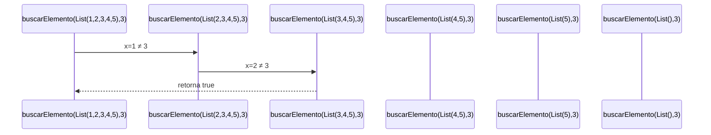

# Informe de proceso BuscarLista

## Definición del Algoritmo

```Scala
package taller

class BuscarLista() {
  def buscarElemento(lista: List[Int], elemento: Int): Boolean = {
    lista match {
      case Nil => false
      case x :: xs => if (x == elemento) true else buscarElemento(xs, elemento)
    }
  }
}
```

* La función `buscarElemento` implementa una búsqueda recursiva en una lista de enteros.
* Su propósito es determinar si un elemento `elemento` pertenece a la lista `lista`.
* Se basa en el patrón de descomposición de listas `(x :: xs)`, característico del paradigma de programación funcional en Scala.
* Utiliza coincidencia de patrones (_pattern matching_) para distinguir entre el caso base (lista vacía) y el caso recursivo (lista con al menos un elemento).

---

## Explicación paso a paso

### Caso base

```Scala
case Nil => false
```

Si la lista está vacía (`Nil`), no hay elementos que comparar, por lo tanto el resultado es `false` y la recursión finaliza.
Este caso garantiza la terminación del algoritmo, evitando una recursión infinita.

---

### Caso recursivo

```Scala
case x :: xs => if (x == elemento) true else buscarElemento(xs, elemento)
```

- Se separa la lista en:
  - `x`: la **cabeza** (primer elemento).
  - `xs`: la **cola** (resto de la lista).
- Si `x` coincide con `elemento`, el resultado es `true`.
- De lo contrario, se realiza una **llamada recursiva** sobre la sublista `xs`.
- En cada paso se reduce el tamaño de la lista, acercándose progresivamente al caso base.

Este comportamiento responde a la definición matemática de pertenencia en una lista:

$$
elemento \in (x :: xs) \iff (x = elemento) \lor (elemento \in xs)
$$

---

## Ejemplo de ejecución

```Scala
val buscador = new BuscarLista()
buscador.buscarElemento(List(1, 2, 3, 4, 5), 3)
```

### Desarrollo paso a paso

buscarElemento(List(1,2,3,4,5), 3)

→ x = 1, xs = List(2,3,4,5)

→ 1 != 3 → buscarElemento(List(2,3,4,5), 3)

→ x = 2, xs = List(3,4,5)

→ 2 != 3 → buscarElemento(List(3,4,5), 3)

→ x = 3 → 3 == 3 → retorna true

**Resultado final: true**

---

## Llamados de pila en recursión

Ejemplo con `buscarElemento(List(1,2,3,4,5), 3)`:



---

## Análisis del comportamiento recursivo

- Cada llamada recursiva queda en la pila de ejecución esperando el resultado de la siguiente.
- Cuando se encuentra el elemento buscado, las llamadas previas se resuelven en orden inverso hasta retornar `true`.
- Si el elemento no está presente, la recursión avanza hasta el caso base (`Nil`), devolviendo `false`.
- En listas muy largas sin coincidencias, puede producirse un desbordamiento de pila (StackOverflowError), propio de la recursión no optimizada en cola.
- Este comportamiento no constituye un error, sino una característica inherente del diseño estructural del algoritmo.

---

## Características técnicas

- **Tipo de recursión:** Recursión lineal no de cola.
- **Naturaleza del problema:** Evaluación estructural sobre listas finitas.
- **Estructura de datos:** `List[Int]`, manipulada mediante pattern matching.
- **Garantía de terminación:** Cada paso reduce el tamaño de la lista hasta llegar al caso base `Nil`.
- **Corrección estructural:** Cumple la definición recursiva de pertenencia:


$$
elemento \in (x :: xs) \iff (x = elemento) \lor (elemento \in xs)
$$

---

## Conclusión

El algoritmo `BuscarLista` cumple con los principios de la programación funcional y aplica recursión estructural sobre listas finitas.
Su diseño utiliza recursión lineal no de cola, lo cual no es una deficiencia, sino una característica necesaria para evaluar la condición posterior al llamado recursivo.
Cada invocación reduce la estructura de entrada y converge al caso base, garantizando la terminación y la corrección funcional del resultado.

En síntesis, `BuscarLista` representa un ejemplo canónico de recursión estructural correcta sobre listas, alineado con la especificación matemática del problema y con los fundamentos teóricos del paradigma funcional en Scala.
